<div align="center">

# Vetha Mithran Sivaraman

**Cybersecurity Student | CompTIA Security+ | CompTIA PenTest+**

Building AI-assisted security tools for SOC workflows, attack reasoning, cloud defense, and practical threat detection.

[](https://www.linkedin.com/in/vethamithran/)
[](mailto:vethamithran@gmail.com)
[](https://github.com/12vethamithran)
[](https://argus-adversarial-reasoning-graph-u.vercel.app)
[](https://noctra-ai-autonomous-soc-platform.vercel.app)

</div>

---

## About Me

I am a cybersecurity student based in India, focused on the intersection of offensive security, defensive engineering, and AI-powered analysis. I like building tools that turn raw security data into useful decisions: alerts, graphs, reports, detections, and investigation paths.

- Certified in **CompTIA Security+** and **CompTIA PenTest+**
- Building practical projects across **SOC analysis**, **threat detection**, **cloud security**, and **adversarial reasoning**
- Currently sharpening skills in **AWS**, **Azure**, **incident response**, and **AI-assisted security workflows**
- Interested in cybersecurity internships, SOC engineering, cloud security, and detection engineering roles

---

## Featured Projects

<div align="center">



</div>

### [ARGUS - Adversarial Reasoning & Graph-based Unified Security Framework](https://github.com/12vethamithran/ARGUS-Adversarial-Reasoning-Graph-Unified-Security)

ARGUS is my featured security research and tooling project: a graph-based framework for reasoning about adversarial behavior, attack paths, and security decisions.

[](https://github.com/12vethamithran/ARGUS-Adversarial-Reasoning-Graph-Unified-Security)
[](https://argus-adversarial-reasoning-graph-u.vercel.app)

**Why it matters**

- Models security activity as connected reasoning paths instead of isolated events
- Helps visualize relationships between signals, attack steps, and defensive decisions
- Explores how AI and graph logic can support analyst workflows
- Built as a practical bridge between security research and usable tooling

### [NOCTRA AI - Autonomous SOC Platform](https://github.com/12vethamithran/NOCTRA-AI-Autonomous-SOC-Platform)

NOCTRA AI is a browser-based SOC platform that turns raw logs into ranked alerts, attack chains, AI-assisted verdicts, and report-ready investigations.

[](https://github.com/12vethamithran/NOCTRA-AI-Autonomous-SOC-Platform)
[](https://noctra-ai-autonomous-soc-platform.vercel.app)

**Why it matters**

- Ingests CSV, JSON, syslog, EVTX, and cloud-style security logs
- Runs deterministic detections, behavioral analysis, and AI-assisted scoring
- Correlates alerts into incident chains for faster SOC triage
- Generates investigation-ready outputs while keeping sessions ephemeral

---

## Project Portfolio

| Project | Focus | Stack / Area |
|---|---|---|
| [ARGUS](https://github.com/12vethamithran/ARGUS-Adversarial-Reasoning-Graph-Unified-Security) | Adversarial reasoning, graph security, attack-path analysis | Python, graph logic, security AI |
| [NOCTRA AI](https://github.com/12vethamithran/NOCTRA-AI-Autonomous-SOC-Platform) | Browser-based SOC platform with log ingestion, detections, AI scoring, and reports | FastAPI, React, Gemini AI, Docker |
| [Piicasso](https://github.com/12vethamithran/Piicasso) | PII intelligence and adversarial wordlist generation | JavaScript, CLI, web app |
| [CloudSentry](https://github.com/12vethamithran/CloudSentry) | AWS security auditing, IAM review, least-privilege analysis | Python, AWS, CloudTrail, IAM |
| [SplunkFlow](https://github.com/12vethamithran/SplunkFlow) | Log analysis and dashboard automation for Splunk workflows | Python, Splunk, log parsing |
| [SecCraft Lab](https://github.com/12vethamithran/SecCraft-Red-Blue-Simulation-Lab) | Red/blue cloud simulation and remediation practice | Python, AWS, security lab |

---

## What I Work On

```text
Threat Detection       SOC Workflows        Cloud Security
Log Forensics          Attack Simulation    Vulnerability Assessment
AI Security Tooling    Incident Response    Detection Engineering
```

---

## Tech & Security Toolkit

**Languages & Development**  
Python, JavaScript, React, FastAPI, Docker, CLI tooling

**Defensive Security**  
SOC analysis, alert triage, log forensics, threat detection, incident response, MITRE ATT&CK mapping

**Offensive Security**  
Penetration testing, vulnerability assessment, OSINT, reconnaissance, web application testing

**Cloud & Platforms**  
AWS, Azure, IAM, CloudTrail, cloud security auditing, least-privilege review

**Tools & Frameworks**  
Wireshark, Nmap, Burp Suite, Metasploit, Nessus, Splunk, OWASP, NIST CSF, MITRE ATT&CK

---

## Current Focus

- Improving AI-powered SOC and investigation workflows
- Building more polished frontend experiences for security tools
- Deepening AWS and Azure security fundamentals
- Practicing detection engineering with real-world log formats
- Turning security ideas into usable, demo-ready products

---

## GitHub Snapshot

<div align="center">


</div>

---

## Connect

I am open to cybersecurity internships, cloud security roles, SOC analyst opportunities, and collaborations on practical security tooling.

<div align="center">

[](mailto:vethamithran@gmail.com)
[](https://www.linkedin.com/in/vethamithran/)
[](https://github.com/12vethamithran?tab=repositories)

</div>
